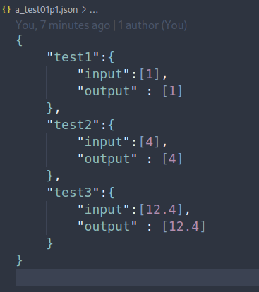

# :ambulance: CTM (Comprehensive Test Manager)

This a tool used to generate tests and use the user's code to test them and give them the results of the test cases
that are held online in the teacher's repo.

## Run script: 
``` 
    cd ctm
    python cli.py
   
```


## How does it work ? 
It creates test files based on the provided JSON formatted tests



Generates the test cases: 


## TECHNOLOGY USED
 - Python

## FUTURE IDEAS 
 - Add a user friendly GUI
 - Generate JSON formatted testcases from recording actual outputs from a working sources code 
 - Package into a single application
 - Pull from a github repo
 - Use this for almost every CSIS course on campus


## FAQ 
<details>

 <summary>Which class is this for ?</summary>
  This is currently for the Programming and Problem Solving [CSIS 2610] but I plan on helping other professors use this as well.

</details>


 
